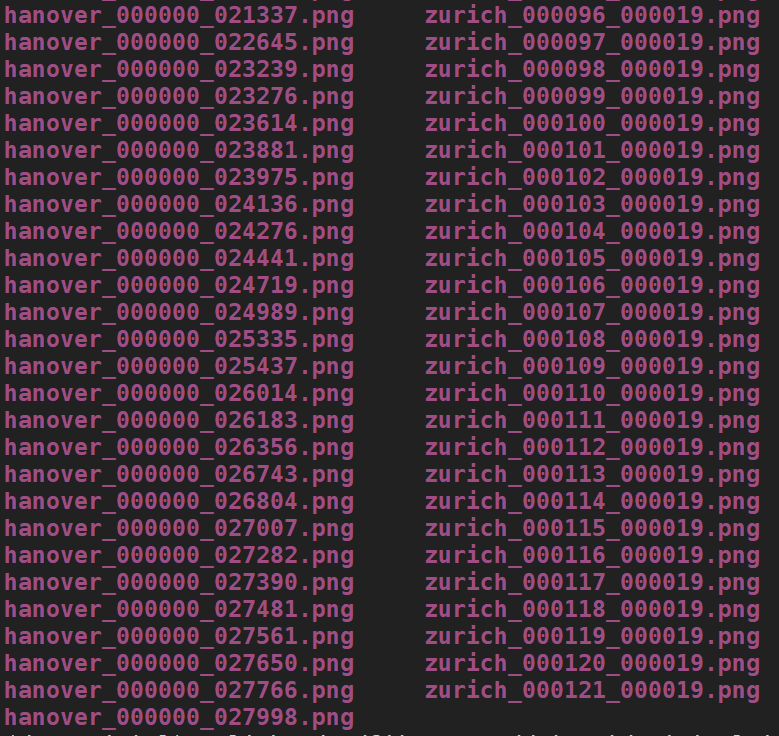
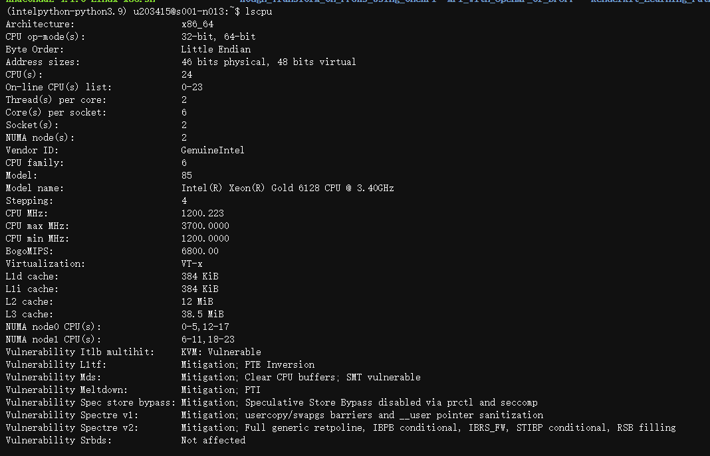
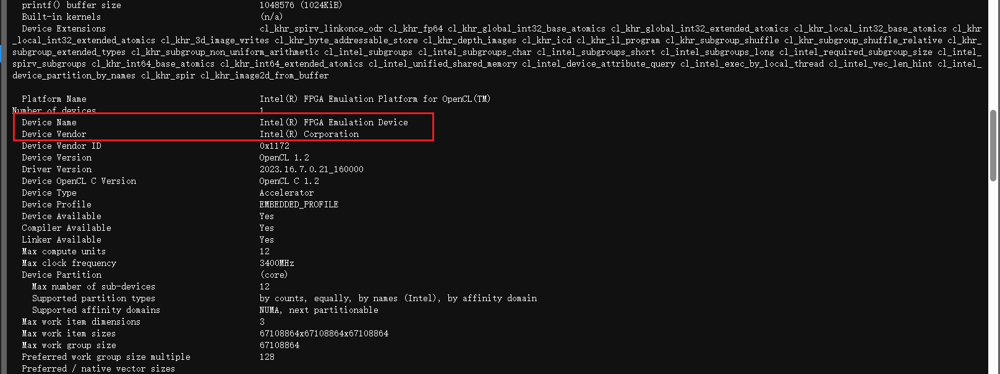

# -Intel-oneAPI-Campus-Hackathon-competition
2023夏季英特尔oneAPI校园黑客松竞赛分享
# 团队名称
兰大超算队
# 问题陈述-

自动驾驶车辆的对象检测: 使用计算机视觉技术和英特尔® AI 分析工具套件为自动驾驶车辆开发实时对象检测模型。城市景观数据集：这个数据集包含高分辨率的城市场景图像，专门用于城市场景语义理解任务。该数据集包含 30 类对象（行人、汽车、公共汽车、自行车等）的 5,000 幅图像，并带有精细注释，我们需要自己设计模型，使用Intel oneAPI环境进行实现。
# 项目简介

## 数据内容

图像: 数据集包含50个城市的街道场景，包括5000张高质量的注释图像（其中2975张用于训练，500张用于验证和1525张用于测试）。
标注: 每张图像都有精细的像素级别的注释，包括30个不同的类别，如“人”，“车”，“建筑”等。
下载和使用:

访问Cityscapes官方网站，并遵循他们的指南注册并下载数据。
解压缩下载的文件，你将得到一个目录结构，其中包含了图像和标注。
数据格式:

图像: 通常是2048x1024分辨率的彩色图像。
标注: 是与图像相对应的像素级标签图。

在这个过程中，我们也对数据进行了预处理，将数据集和数据标签进行了对应。将数据集放在同一目录下，方便我们代码的执行。

## 技术方案

在我们的方案实现过程中，我们使用到了英特尔® AI 分析工具套件，英特尔tensorflow==2.9.0，

经过不同的模型测试，并且参考Intel官方所给出的示例代码，主要采用了ResNet50，ResNet50 是深度学习中的一种流行的卷积神经网络架构，特别是在图像分类任务中。它是 ResNet（Residual Network）家族的成员之一。 我们在encoder函数中，主要实现核心以下代码：

def get_resnet_encoder(input_height=1024, input_width=2048, pretrained='imagenet'):
    base_model = ResNet50(weights=pretrained, include_top=False, input_shape=(input_height, input_width, 3))

    f1 = base_model.get_layer('conv1_relu').output
    f2 = base_model.get_layer('conv2_block3_out').output
    f3 = base_model.get_layer('conv3_block4_out').output
    f4 = base_model.get_layer('conv4_block6_out').output
    f5 = base_model.get_layer('conv5_block3_out').output
    
    return base_model.input, [f1, f2, f3, f4, f5]

此外，我们将Cityscapes官方网站下载的数据集进行了30类的分类，将训练图片和生成的标签图片进行对应
使用Adam优化器，它是深度学习中最流行的梯度下降优化器之一。它结合了两种先前的技术，即Momentum和RMSprop，以提供适应性的学习率。Adam 通常在许多深度学习任务中都表现得相当好，尤其是在大数据和大参数空间中，通过不同的优化器和学习率交叉验证，选择lr=0.001作为最终的学习率。

在本次的代码中，我们调整了不同的epoch和batch_size 来进行较好的模型训练。

# 实验环境

在Intel DevCloud环境中进行了运行测试。
主要实验环境如下：

## 感受

在这个过程中，我们使用到了Intel oneAPI提供到的一些环境和技术，其中带有英特尔TensorFlow比起普通的tensorflow版本在处理速度上有所提升，在使用过程中也非常的方便，直接导入相关的版本即可，并且，官网也提供的相关的参考代码案例，使用过程中十分的方便快捷。

当然我们在Intel DevCloud上运行的时候，为了更快捷的调整模型的参数，我们也在A100进行了训练测试，虽然Intel GPU在速度上与A100有缺欠缺，但是总体作为学习和实践仍然是具有非常大的意义。特别是Intel 自己推出的TensorFlow版本，在数据处理和计算过程中的性能还错相对不错的。

不过一点不足的是：我们在使用Intel DevCloud 上传数据集的时候花费了较大的时间，因为数据集较大的时候，上传过程中很容易断开，导致数据的预处理过程受到限制，希望Intel DevCloud 能够在这方面进行一个优化，方便下次更多的用户能够进行较大数据的模型测试。并且关于Intel 方面推出的深度学习框架建议可以进行视频的宣讲和学习，这样可以更加清楚的让用户认识到所做的具体加速代码优化方案有哪些。

